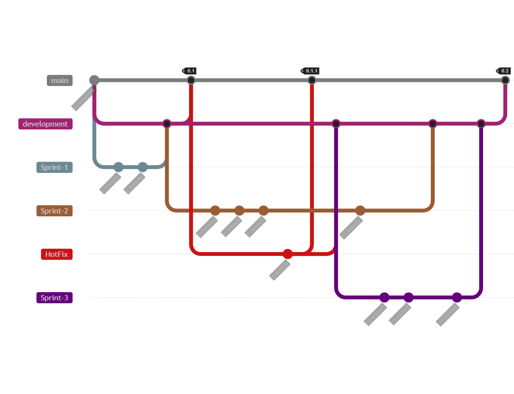

# Github guide

***Vous ne connaissez pas Github ?*** Pas de panique ! Cette page vous expliquera en profondeur comment se faire de
Github pour le projet. Il s'adresse autant aux débutants, qu'aux experts. Vous retrouverez dans ce guide :

- Qu'est-ce que Github ?
- Comment s'en servir ?
- Les équipes et les projets.
- Les règles et workflow appliqué au projet.
- etc.

## Qu'est-ce que Github ? Comment s'en servir ?

D'abord il faut savoir ce qu'est **Git**. Git est un SCM pour 'Source Control Manager' ou gestionnaire de source code en
français. C'est un outil permettant de stocker le code source d'un ou plusieurs projets, de travailler de manière
collaborative et de manière simultanée. Git n'est pas le seul SCM il en existe plein d'autre tels que Subversion, Helix
Core, etc. on a parlé de Git, mais qu'est-ce que **Github ?** C'est tout simplement une platform en ligne basée sur Git.
Il existe d'autre platforms tels que Gitlab mais la plus connue.

À cet effet, une <a href="https://github.com/UTBM-FISA-TutoredProject" target="_blank">organisation Github</a> a été
créée pour le projet tutoré. Une organisation est tout simplement une structure morale (entreprise, école, groupe, etc.)
sur Github. Une organisation regroupe des personnes, des "repositories" qui sont des "dossiers" de stockage de code
source, des projets, discussions, etc.

:exclamation: Si vous ne faites pas partie de l'organisation Github et que vous souhaitez y
participer, contactez le référent Github (<a href="mailto:kilian.goetz@yahoo.fr">Contact</a>). :exclamation:

## Équipes et projets

À l'image de la précédente <a href="https://utbm-fisa-tutoredproject.github.io/Documentation/#/organisation">section</a>
le github possède **4 équipes** et une **5ème** qui est une équipe globale. Chacune des équipes possède son
propre projet, qui détiennent des "vues" qui sont soit des kanbans, soit des tableaux.

***Qu'est-ce qu'un Kanban ?*** Un kanban est un tableau graphique composé d'un nombre n de colonnes représentant chacun
un status. Vous pouvez créer dans ces colonnes des cartes contenant chacune une idée ou un travail à effectuer. Ces
différentes cartes peuvent agrémenter de champs spécifiques tels que : une personne assignée, une priorité, une
deadline, un sprint, etc.

Les Kanbans sont définis de la même manière dans toutes les équipes :

- :x: **Bug :** Colonne contenant les bugs identifiés.
- :bulb: **ideas :** Colonne contenant les idées potentielles de nouvelles fonctionnalités.
- :clipboard: **Todo :** Colonne contenant les fonctionnalités à implémenter.
- :broken_heart: **Review rejected :** Colonne contenant les revues de code rejeté par le relecteur.
- :clock1: **In Progress :** Colonne contenant les fonctionnalités en cours d'implémentation.
- :eyes: **To review :** Colonne contenant les fonctionnalités terminées nécessitant une revue du code par un autre
  membre de l'équipe avant un merge.
- :eyes: :clock1: **Reviewing :** Colonne contenant les fonctionnalités terminées en cours d'examination par un
  relecteur. :exclamation: Si le relecteur n'accepte pas le code la carte sera renvoyer dans la
  colonne ":broken_heart: Review rejected" :exclamation:
- :heavy_check_mark: **Done pending on merge :** Colonne contenant les fonctionnalités terminées et vérifier prête à
  être merge.
- :file_folder: **Archived :** Colonne contenant les fonctionnalités terminées, vérifier et merge au projet. :
  exclamation: Attention, une fois entièrement terminées il ne faut pas supprimer les cartes,
  mais les laissez dans cette colonne. Cela permet d'avoir un aperçu clair de ce qui a été fait :exclamation:

***Vue en tableau ?*** Les tableaux de projets sont de simple tableaux groupés et trier selon des filtres. Par exemple
un tableau **"By Priority"** dans lequel le travail est rangé par priorité. Les vues en tableau sont bien pour
visualiser de façon efficace un grand nombre d'idées et d'identifier plus facilement celles-ci.

<video controls style="width:80%">
  <source src="./_media/GithubProjects.webm" type="video/mp4">
</video>

## Workflow et règles

Dans l'organisation vous retrouverez 5 repositories :

- **Documentation** : Contenant le source code du site de documentation que vous êtes en train de lire. Cette
  documentation est faite en markdown et le site est généré via <a href="https://docsify.js.org/#/" target="_blank">
  Docsify</a>. Vous pouvez participer à l'élaboration de la documentation si vous le souhaitez, pour cela contacter
  le <a href="mailto:kilian.goetz@yahoo.fr">Référent Github</a> qui vous octroiera les droits nécessaires.
- **Frontend** : Contenant le source code de la partie IHM du site internet.
- **Backend** : Contenant le source code de la partie traitement des données du site internet.
- **Infrastructure** : Contenant les scripts de gestion de l'infrastructure.
- **.github** : Contenant "le README.md" présentant l'organisation affichée sur l'accueil.

Selon votre appartenance aux différentes équipes, vous aurez soit un accès de lecture, soit d'écriture sur chacun de ces
repositories.

<a href="https://docs.github.com/en/repositories" target="_blank">***Comment fonctionne un repository ?***</a>

Un repository est composé de
plusieurs <a href="https://docs.github.com/fr/pull-requests/collaborating-with-pull-requests/proposing-changes-to-your-work-with-pull-requests/about-branches" target="_blank">"
branch"</a> ou branche en français. Il y a une branche principale nommée "main" ou "master" (dans tous les projets par
uniformité, cela sera "main") et des branches tier qui est une copie d'une branche à un instant T. **Quel est l'intérêt
?** Avoir une copie du code à un instant t que l'on peut modifier sans tout cassé. Une fois que vous avez apporté les
modifications que vous souhaitiez à votre code et que celui-ci est stable vous pouvez "merge" une branche vers sa
branche source.

***Et dans notre cas ?*** Les projets seront composés d'une branche "main" étant la branche principale sur laquelle les
commits sont strictement interdit. La branche principale contient les versions de production. Une seconde branche "
developement" étant une branche créée à partir de la branche principale, celle-ci héberge la version en cours de
travail. Des branches de sprint ou de fonctionnalité créée à partir de la branche développement, elles hébergent les
différents commits liés au développement d'une fonction. ET il y a les branches de Hotfix créer à partir de la branche
principale, celles-ci permettent de traiter un bug remonter par le client rapidement.

Pour merge une branche liée à un sprint ou une fonctionnalité une "pull request" doit être émise pour une relecture du
code par une personne. Le relecteur pourra soit valider ou demander des changements. Si elle est validée la branche peut
être merge. Pour merge la branche développement, cela est plus compliqué, il faut passer un commité de validation entre
les différents référents de chaque équipe. Une fois merge les codes sources du backend et frontend sont déployés par
l'équipe infrastructure.

Tout ce que je viens d'expliquer s'appelle un workflow voici un schéma du workflow.

***Commit signé*** : Pour des raisons de temps les commits signé ne seront pas obligatoire. Néanmoins, je vous invite si
vous le souhaitez de signer vos commits. **L'intérêt ?** Cela permet de certifier que c'est bien vous qui effectuez le
commit. Imaginer que pour une raison x ou y vous laissez votre poste de travail allumé et que vous partez. Une personne
peut prendre votre poste, mettre du code malveillant et le commit sur le projet. Quand vous signez les commits, l'IDE
vous demandera un mot de passe que vous avez défini ce qui certifiera que cela est bien vous. Cela est un peu compliqué
à mettre en place, mais il est recommandé de le faire pour plusieurs raisons :
- Cela vous apprendra comment faire.
- Cela apporte de la confiance et montre que vous travaillez de manière professionnelle.
- Et surtout, c'est quelque chose de très commun en entreprise donc une plus valu pour vous.